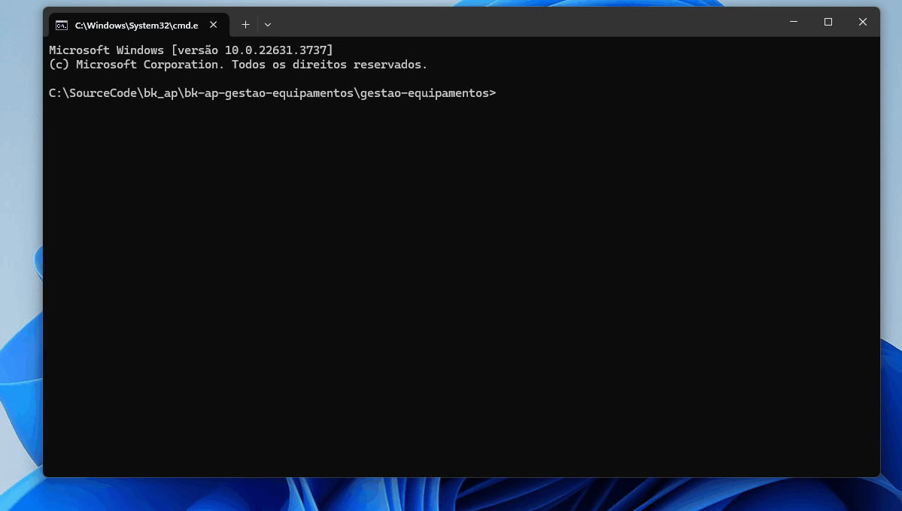

# Controle de Equipamentos V01

Junior cuida do estoque de equipamentos na empresa onde trabalha. E sempre controla o inventário dos seus equipamentos e as manutenções que eles já sofreram em uma planilha do Excel.

Desta forma, ele resolveu pedir ajuda do pessoal da Academia do Programador no desenvolvimento de um Software para automatizar o seu serviço.  



## Planilha V01

```
Número;Nome do Equipamento;Preço;Número de Série;Data de Fabricação;Fabricante;Data da Última Manutenção
001;Computador Dell XPS;3500.00;SN123456;2022-01-15;Dell;2023-06-12
002;Impressora HP LaserJet;1200.00;SN234567;2021-11-20;HP;2023-06-01
003;Projetor Epson;2500.00;SN345678;2023-03-05;Epson;2023-06-05
004;Roteador TP-Link;300.00;SN456789;2020-07-18;TP-Link;2023-05-15
005;Telefone IP Cisco;600.00;SN567890;2019-09-25;Cisco;2023-04-20
006;Notebook Lenovo ThinkPad;4500.00;SN678901;2021-06-10;Lenovo;2023-05-30
007;Monitor LG UltraWide;1200.00;SN789012;2022-04-12;LG;2023-03-12
008;Scanner Canon;800.00;SN890123;2021-08-30;Canon;2023-02-15
009;Servidor Dell PowerEdge;15000.00;SN901234;2020-02-25;Dell;2023-01-25
010;Switch Cisco;2000.00;SN012345;2019-12-15;Cisco;2023-04-05
```

## Autenticação

Criar uma tela para solicitar login de usuario.

Deve pedir logon
Deve pedir senha

## 1. CRUD de Equipamentos
## 1.0.1 CREATE
Requisito 1.1: Como funcionário, Junior quer ter a possibilidade de registrar equipamentos.

- Deve ter um nome com no mínimo 6 caracteres;
- Deve ter um preço de aquisição;
- Deve ter um número de série;
- Deve ter uma data de fabricação;
- Deve ter um fabricante;
- Deve ter uma data da ultima manutenção

## 1.0.2 READ
Requisito 1.2: Como funcionário, Junior quer ter a possibilidade de visualizar todos os equipamentos registrados em seu inventário.

Deve mostrar o número;
Deve mostrar o nome;
Deve mostrar o preço;
Deve mostrar o nome;
Deve mostrar o fabricante;
Deve mostrar a data de fabricação;
Deve mostrar a data da ultima manutenção

## 1.0.3 UPDATE
Requisito 1.3: Como funcionário, Junior quer ter a possibilidade de editar um equipamento, sendo que ele possa editar todos os campos.

Deve ter os mesmos critérios que o Requisito 1.0.1

## 1.0.4 DELETE
Requisito 1.0.4: Como funcionário, Junior quer ter a possibilidade de excluir um equipamento que esteja registrado.


# Controle de Equipamentos V02

Junior gostou da entrega da V01 e agora conseguiu melhorar a gestão dos equipamentos e pediu para evoluirmos o software dele. Ele quer ter a possibilidade de importar e exportar dados em CSV, gerir tipos de equipamentos, fabricantes, funcionários que realizaram a manutenção, e clientes que alugam os equipamentos. Além disso, ele quer aprimorar a gestão dos equipamentos, permitindo indicar o cliente que está locando o equipamento e adicionando novas validações.

## Novas Funcionalidades

### 1. Importação e Exportação de CSV
Requisito: Como funcionário, Junior quer ter a possibilidade de importar e exportar os dados dos equipamentos em formato CSV.

- Importar dados a partir de um arquivo CSV.
- Exportar dados para um arquivo CSV.

### 2. CRUD de Tipos de Equipamentos
Requisito: Como funcionário, Junior quer ter a possibilidade de cadastrar e gerir tipos de equipamentos e suas características.

#### 2.1 CREATE
- Deve permitir cadastrar nome do tipo de equipamento.
- Deve permitir adicionar componentes como processador, suprimento e custo de aluguel do equipamento.
- Deve permitir adicionar descrição detalhada, especificações técnicas e categoria.
- Não deve permitir o cadastro de dados repetidos.

#### 2.2 READ
- Deve permitir visualizar todos os tipos de equipamentos cadastrados.

#### 2.3 UPDATE
- Deve permitir editar os dados dos tipos de equipamentos cadastrados.

#### 2.4 DELETE
- Deve permitir excluir tipos de equipamentos cadastrados.

### 3. CRUD de Fabricantes
Requisito: Como funcionário, Junior quer ter a possibilidade de cadastrar e gerir fabricantes.

#### 3.1 CREATE
- Deve permitir cadastrar o nome do fabricante.
- Deve registrar a data de cadastro.
- Deve associar o fabricante a um fornecedor.
- Deve permitir adicionar endereço, informações de contato, website e lista de produtos.
- Não deve permitir o cadastro de dados repetidos.

#### 3.2 READ
- Deve permitir visualizar todos os fabricantes cadastrados.

#### 3.3 UPDATE
- Deve permitir editar os dados dos fabricantes cadastrados.

#### 3.4 DELETE
- Deve permitir excluir fabricantes cadastrados.

### 4. CRUD de Funcionários
Requisito: Como funcionário, Junior quer ter a possibilidade de cadastrar e gerir funcionários que realizam a manutenção.

#### 4.1 CREATE
- Deve permitir cadastrar o nome do funcionário.
- Deve registrar o identificador do funcionário.
- Deve registrar a data de início do contrato de trabalho.
- Deve especificar a função do funcionário.
- Deve permitir adicionar e-mail, telefone, departamento e supervisor.
- Não deve permitir o cadastro de dados repetidos.

#### 4.2 READ
- Deve permitir visualizar todos os funcionários cadastrados.

#### 4.3 UPDATE
- Deve permitir editar os dados dos funcionários cadastrados.

#### 4.4 DELETE
- Deve permitir excluir funcionários cadastrados.

### 5. CRUD de Clientes
Requisito: Como funcionário, Junior quer ter a possibilidade de cadastrar e gerir clientes que alugam os equipamentos.

#### 5.1 CREATE
- Deve permitir cadastrar CNPJ ou CPF.
- Deve registrar o nome do cliente.
- Deve registrar a localização do cliente.
- Deve registrar o custo mensal do cliente.
- Deve permitir adicionar contato principal, e-mail, telefone, endereço completo, tipo de cliente e detalhes do contrato de serviço.
- Não deve permitir o cadastro de dados repetidos.

#### 5.2 READ
- Deve permitir visualizar todos os clientes cadastrados.

#### 5.3 UPDATE
- Deve permitir editar os dados dos clientes cadastrados.

#### 5.4 DELETE
- Deve permitir excluir clientes cadastrados.

### 6. CRUD de Equipamentos
Requisito: Como funcionário, Junior quer ter a possibilidade de associar equipamentos a clientes.

#### 6.1 CREATE
- Deve permitir indicar o cliente que está alugando o equipamento.
- Deve permitir registrar o status do equipamento (disponível, em manutenção, alocado).
- Deve permitir registrar a localização atual do equipamento.
- Deve permitir adicionar informações sobre a garantia e anotações adicionais.
- Deve poder escolher o tipo de equipamento.
- Deve poder escolher o fabricante.
- Deve ter um local para adicionar manutenção e quem fez essa manutenção e data da execução.
- Não deve permitir o cadastro de número de série de equipamentos repetidos por tipo e fabricante.

#### 6.2 READ
- Deve permitir visualizar todos os equipamentos cadastrados.

#### 6.3 UPDATE
- Deve permitir editar os dados dos equipamentos cadastrados.

#### 6.4 DELETE
- Não deve permitir a remoção de um equipamento se ele estiver alocado a um cliente.
- Deve permitir excluir equipamentos cadastrados.

## 7. Autenticação
Requisito: Manter a tela de login com autenticação de usuário.

- Deve solicitar login e senha para acessar o sistema.


## Objetivos de aprendizagem V02
- Reforçar entendimento de Interface
- Aprender Generics
- Aprender mais sobre classes de data
- Aprender uso de arquivo
- Reforço MVC
- Aprender sobre UserControl
- Abstração
- Polimorfismo
- Herança
- Reforço padrão repositorio
- Construtor
- Destrutor
- Prototipação
- Modularização
- Reforço lógica
- Manejo de Exceções: Aprender a capturar e tratar exceções
- Eventos e Delegates: Entender e usar eventos e delegates
- LINQ (Language Integrated Query): Aprender a usar LINQ para manipulação de dados
- Binding de Dados: Aprender a vincular dados a controles de interface do usuário
- Reforço GIT
---
## Requisitos

- .NET SDK (recomendado .NET 8.0 ou superior) para compilação e execução do projeto.
---
## Como Usar

#### Fork repositorio
```
git clone https://github.com/Academia-programador-back-end-2024/bk-ap-gestao-equipamentos.git
```

#### Navegue até a pasta raiz da solução
```
cd gestao-equipamentos
```

#### Restaure as dependências
```
dotnet restore .\GestaoEquipamentos.sln
```

#### Navegue até a pasta do projeto
```
cd GestaoEquipamentos.WinFormsApp
```

#### Execute o projeto
```
dotnet run
```


